### 简介

> 工作流工具，为被集成而生，易集成已有系统，不依赖组织架构数据结构来创建审批人。

<a href="http://101.43.138.169/wfhtml/" target="_blank">演示DEMO地址</a>

<font color=#f06431>测试账号testemp1，密码123，测试默认用户密码都是123。</font>

### 安装部署
项目由两部分组成：
- **流程引擎:**  负责流程流转，包含动态脚本、流程推进等流程核心

- **后台配置:**  负责后台管理配置项目，包含组织、用户、登录、表单管理等，可自行扩展、修改代码

1、下载

包含几个文件：

1、flow.rar

2、engine.rar

3、all.sql

4、wfhtml.rar

2、解压

flow.rar包含内容：

-flow_prod.jar

-application-prod.properties

engine.rar包含内容：

    -webapp.exe

    -res目录

        -00000000-0000-0000-0000-000000000001目录

            -common.vds

        -appkeys.json

    -config目录

        -settings.json

        -userinfo.vds

sql.rar包含内容：

-all.sql

3、运行

* 创建数据库wfengine，运行all.sql

* engine解压后config目录下的settings数据库连接为刚创建的数据库，执行webapp.exe运行流程引擎

* flow解压后application-prod.properties中修改数据库连接为刚创建的数据库，执行：

  java -jar -Dspring.config.location=application-prod.properties flow_prod.jar
  
* wfhtml解压后，使用nginx等静态文件服务配置目录，发布前端

### <a id="use_default">直接使用</a>

Demo后台自带一部分测试数据，包括部门/人员、几条测试流程的配置。

测试账号登录可以维护自己的部门人员数据，增加流程配置。

ou / 部门人员：增加部门、人员信息

model / 创建流程模板：分4步来创建一个流程模板

- **流程定义:**  创建流程标识（作为流程单号前缀）、名称、图标（自带10个图片0~9.png）

- **模型定义:**  创建流程中使用的数据模型（可以理解为单表数据存储表）

- **表单设计:**  创建表单，用于流程节点上挂的表单，表单控件元素可以绑定上一步骤的模型

- **流转设计:**  创建流程，绑定表单，编写候选人和路由的脚本

### <a id="interface_integration">接口集成</a>

可以调用以下接口来使用工作流引擎，业务数据自行存储，调用方需实现业务和引擎接口的事务：

- /api/ext/apply/{process_name}/submit_raw （创建申请单）:

```
  [POST]  header:

无（暂时没有鉴权限制）

{ args:{
  wf_order_no:  //申请单号
  emp_id:  //提交申请的用户Id
  emp_display:  //提交申请的用户姓名
  ...
  }
}

以上是必须传递的参数，如果需要在候选人/路由脚本中携带业务数据，则在args中新定义，在脚本执行时能获取到。

自定义key对应的value仅支持整型和字符串，按需在脚本中转换。

eg：{ args:{wf_order_no:"bx-20211121-00001",emp_id:"5",emp_display:"张三","days":3,"category":"year"} }

days和category将在脚本中能获取到，脚本使用参见下面<a href="#script">动态脚本</a>。
```

### 流程引擎

### <a id="create_flow">表单设计</a>

**表单设计器可以绑定模型，布局控件排版**

<a href="imgs/form.png" target="_blank" title="查看大图">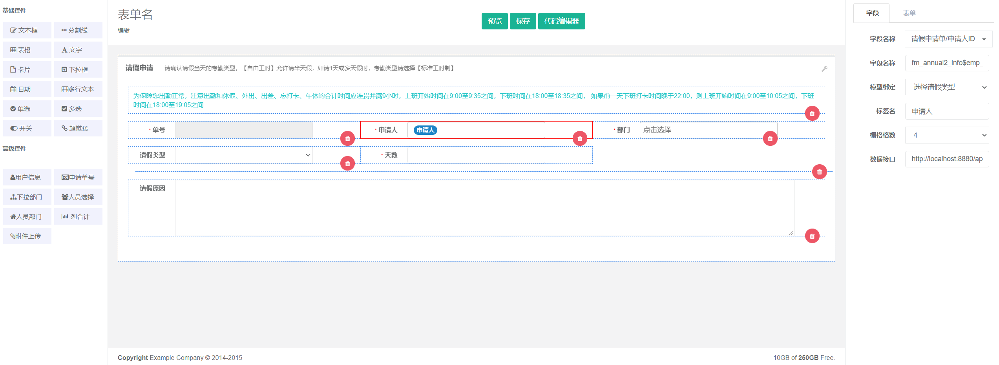</a>

*点击左侧控件，中间设计面板可以调整布局（为了保证表单样式统一，布局前先放入卡片控件，除了表格其他子控件放入其中）

*右侧选择字段可绑定模型字段，配置不同数据源，绑定的接口API按照指定格式返回动态数据

*设计完成点击“保存”

<a href="imgs/controls.png" target="_blank" title="查看大图"></a>

*默认自带基础控件，按照开发规则可拓展自定义控件

<a href="imgs/properties.png" target="_blank" title="查看大图">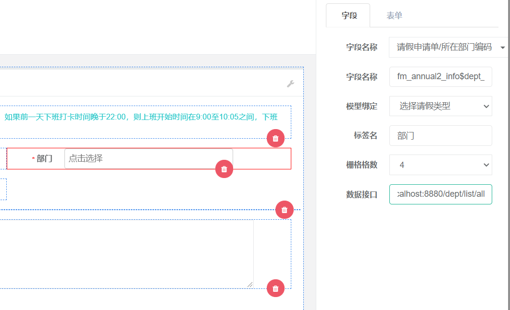</a>

*属性面板配置控件绑定模型、数据源、栅格等

### <a id="create_flow">流程设计</a>

**流程设计器可以灵活配置流转和节点审批人**

<a href="imgs/flow_design.png" target="_blank" title="查看大图">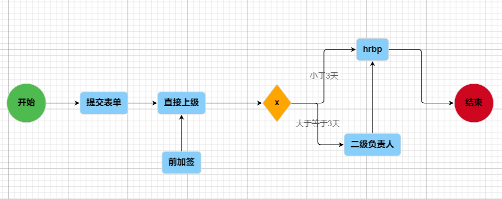</a>

*拖入开始、结束节点，设置提交节点；配置任务和路由节点属性和脚本；*

- **设置节点连线文字:** 

<a href="imgs/transition.png" target="_blank" title="查看大图">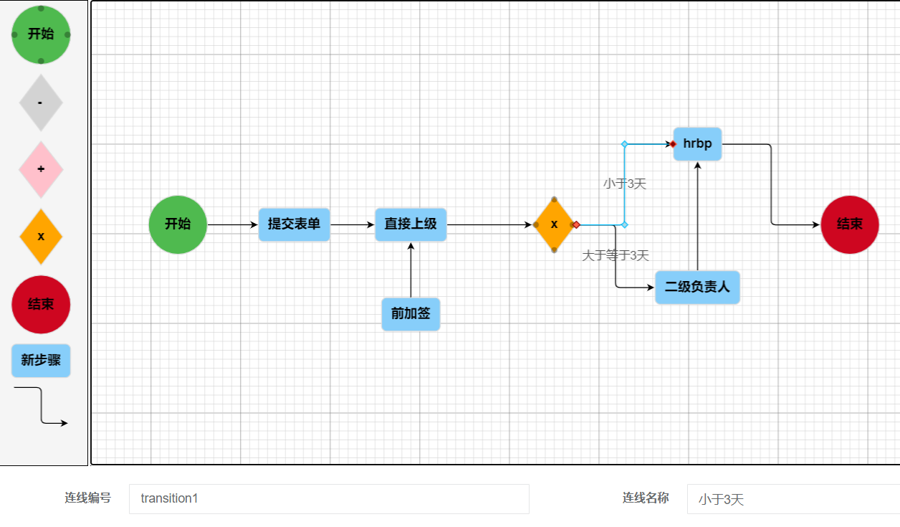</a>

- **设置任务节点:** 

<a href="imgs/task.png" target="_blank" title="查看大图">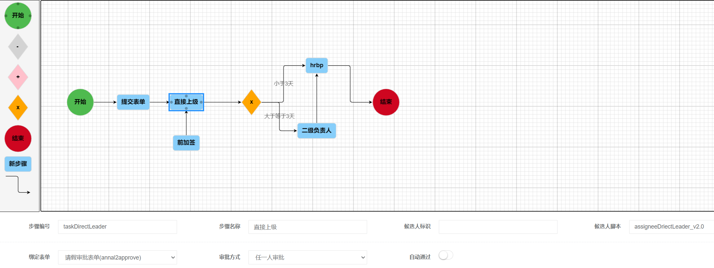</a>

*可设置关联的表单、返回候选人的脚本、审批的类型*

- **编写任务节点候选人脚本:** 

<a href="imgs/task_script.png" target="_blank" title="查看大图">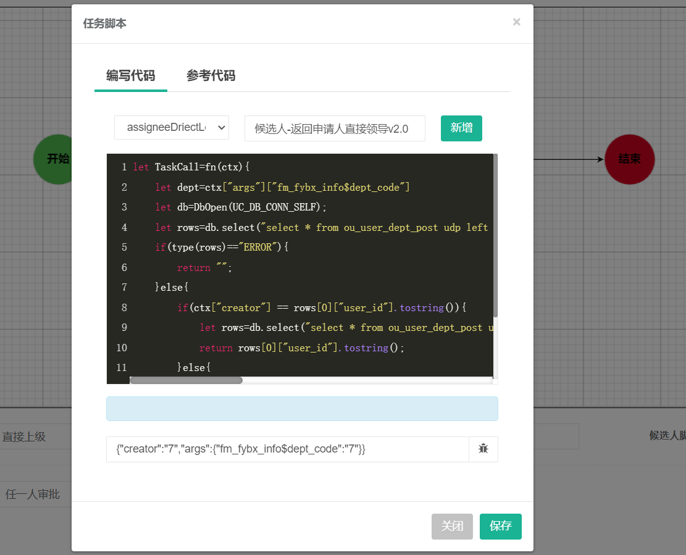</a>

- **设置路由节点:** 

<a href="imgs/decision.png" target="_blank" title="查看大图"></a>

*可设置路由跳转的脚本返回任务节点 - 指定的taskId*

<a href="imgs/decision_script.png" target="_blank" title="查看大图">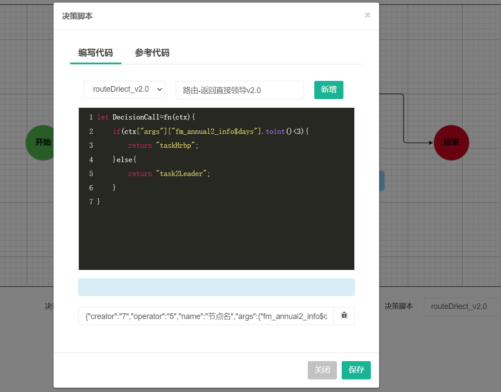</a>

### <a id="script">动态脚本</a>
#### <a id="script_desc">脚本简介</a>
动态脚本组件有完整的语法解析、词法分析、解析树求值阶段；

实现了最小级类C编程语言，动态解析。附带了一些常用作为胶水语言特性、函数，如：字符串处理、数据访问、Http访问等。

能满足轻量级业务，语法支持定义、分支、循环、跳出；

内置数据结构包含字符串、整形、列表、字典对象；

对象上有不同内置函数，良好的设计框架让有能力扩展脚本功能的开发人员可以自定义语言特性；

#### <a id="lexer">脚本语法</a>
* 一共内置了9个保留关键字：**let**、**fn**、**true**、**false**、**return**、**if**、**else**、**elseif**、**for**

* 一共内置了3个全局函数：**println(对象)**、**len(对象)**、**type(对象)**

* 支持二元操作符：**+-\*/**

#### `let`
声明变量，可以是普通的字符串、数字、布尔值、列表、字典、函数

```
let myStr = "string";  #字符串

let myInt = 10;  #数字

let myBoolen = false;  #布尔值

let myArray = [10,9];  #列表

let myDict = {"id":10,"name":"test"};  #字典

let myFunction = fn(x,y){ return x+y; };  #函数
```

#### `fn`
定义函数

```
let myFunction = fn(x,y){   #定于函数
    return x+y; 
};

myFunction(1,2);  #调用函数

fn(x,y){  #匿名函数，返回3
    return x+y; 
}(1,2);  

#高阶函数
let add = fn(x,y){   #定于加法函数
    return x+y; 
};
let times = fn(x,y){   #定于乘法函数
    return x*y; 
};
let foo=fn(a,b,func){  #传递函数参数
    return add(a,b); 
};

#支持递归
let fib = fn(n) {
	if (n == 1) {
		return n;
	} else {
		return fib(n-1)+n;
	}
};
fib(100);
```
#### `true false`
布尔类型 - 真/假

#### `return`
函数返回值

#### `if/elseif/else`
判断语句

```
if(x){
    #语句块1
}elseif(y){
    #语句块2
}else{
    #语句块3
}
```

#### `for`
循环语句，不支持++、--操作

```
for(let i=0; i<10; i+1){  #注意：步长表达式仅支持二元运算符
    println(i); 
}
```

#### `#`
注释，#+内容 出现在一行语句末尾

```
#非法
let a = 1;#我是注释 println(a);

#合法
let a = 1; println(a); #我是注释

#合法
let a = 1;  #我是注释1
#我是注释2
#我是注释3
println(a); #我是注释4
#我是注释5
```

如果输入错误或非法关键字语法解析会提示错误:
> expected next token to be 'let', got 'bad' instead.

#### <a id="object">数据类型</a>
* 一共内置了7个数据类型：整型、字符串、布尔值、列表、字典、函数、[异常]

每种类型都有自带的内置函数：如下

#### `整型`
有符号整型，type函数，返回 INTEGR。整型对象上的函数：

|  函数名   | 说明  |  输入参数   | 返回结果  |
|  ----  | ----  | ----  | ----  |
| <font color=#090>tostring</font>  | 整型转字符串 | 无 | 字符串 |


```
let int = 10;
int.tostring();  #返回 "10"
```

#### `字符串`
字符串，type函数，返回 STRING。字符串对象上的函数：

|  函数名   | 说明  |  输入参数   | 返回结果  |
|  ----  | ----  | ----  | ----  |
| <font color=#090>toint</font>  | 字符串转整型 | 无 | 整型 |
| <font color=#090>split</font>  | 分割字符串 | 分隔符 | 字符串列表 |
| <font color=#090>indexof</font>  | 查找子字符串位置，不存在返回-1 | 子字符串 | 位置 |

```
let a2i = "100";
a2i.toint();  #返回 100

let str = "string-test";
str.split("-");  #返回 ["string","test"]

let str = "string-test";
str.indexof("g");  #返回 5
```

#### <a id="buildin">内置函数</a>

#### `println`
打印对象，支持所有对象输出字面量

```
let a = {"id":1,"name":"vivid"};
println(a);
#打印 { id:1, name:vivid }
```

#### `len`
对象长度，支持列表、字符串的长度，其他类型会提示错误

```
let a = [1,2];
len(a);
#返回2
```

#### `type`
对象类型，支持所有对象输出类型字符串

```
let str = "string";
type(str); #返回 STRING

let int = 1;
type(int); #返回 INTEGR

let array = [1,2,3];
type(array); #返回 ARRAY

let dict = {"id":1};
type(dict); #返回 HASH

let i = 10;
let e = 0/i;
type(e); #返回 ERROR

let function = fn(){};
type(function); #返回 FUNCTION
```

### 返回候选人

> 候选人脚本固定为TaskCall(ctx)函数，ctx为本次上下文+表单内参数

```
ctx数据：
{
"creator":创建人ID,"operator":操作人ID,"name":任务节点Key,"parent_operator":上一任务节点操作人ID,"parent_name":上一任务节点Key,

"args":表单内的参数，默认是表单绑定的模型Key（eg：表单设计器内的字段名 fm_annual2_info$dept_code）

}
```
UC_DB_CONN_SELF为数据库连接

```
【获取直接上级】

let TaskCall=fn(ctx){
    let dept=ctx["args"]["fm_fybx_info$dept_code"]
    let db=DbOpen(UC_DB_CONN_SELF);
    let rows=db.select("select * from ou_user_dept_post udp left join ou_post_info pi on udp.post_code=pi.code where pi.flag='leader' and dept_id=?",dept);
    if(type(rows)=="ERROR"){
        return "";
    }else{
    	if(ctx["creator"] == rows[0]["user_id"].tostring()){
        	let rows=db.select("select * from ou_user_dept_post udp left join ou_post_info pi on udp.post_code=pi.code where pi.flag='leader' and dept_id=(select parent_id from ou_dept_info where id=?)",dept);
            return rows[0]["user_id"].tostring();
        }else{
        	return rows[0]["user_id"].tostring();
        }
    }
}
```

```
【申请人上上级负责人】

let TaskCall=fn(ctx){
    let dept=ctx["args"]["fm_annual2_info$dept_code"]
    let db=DbOpen(UC_DB_CONN_SELF);
    let leaderRows=db.select("select * from ou_user_dept_post udp left join ou_post_info pi on udp.post_code=pi.code where pi.flag='leader' and dept_id=?",dept);
    if(type(leaderRows)=="ERROR"){
        return "";
    }else{
        let fullPath=db.select("select full_path_id from ou_dept_info where id=?",dept);
		let arr = fullPath[0]["full_path_id"].split("/");  #提交人部门全路径
    	if(ctx["creator"] == leaderRows[0]["user_id"].tostring()){  #提交人是本部门负责人，往前找2级
	    let path = arr[len(arr)-3];
	    let newLeader = db.select("select * from ou_user_dept_post udp left join ou_post_info pi on udp.post_code=pi.code where pi.flag='leader' and dept_id=?",path);
	    return newLeader[0]["user_id"].tostring();
        }else{
	    let path = arr[len(arr)-2];
	    let newLeader = db.select("select * from ou_user_dept_post udp left join ou_post_info pi on udp.post_code=pi.code where pi.flag='leader' and dept_id=?",path);
        return newLeader[0]["user_id"].tostring();
        }
    }
}
```
### <a id="control_api">控件API</a>
HOST http://localhost:8880

所有接口都能被二开重写替换，只要符合请求的入参和返回值，均能绑定到控件。

#### <a id="control_order">申请单号</a>
```
绑定以code开头的自增单号

/api/common/billcode_gen/{code}

返回字符串，eg：

自定义-20220211-00001

```

#### <a id="control_userinfo">用户信息</a>
```
绑定用户信息

/api/user

入参：uid={id}

返回对象，eg：

{"id":5,"name":"wuwei2_m","num":"CY00001","displayName":"吴伟2","gender":"M","mail":"wuwei2_m@cyou-inc.com","mobile":null,"remark":null,"password":"","createTime":"2021-05-21T16:55:53","updateTime":"2021-05-24T16:17:43","extC1":null,"extC2":null,"extC3":null,"extI1":null,"extI2":null,"extI3":null,"extD1":null}

```

#### <a id="control_deptselect">用户部门</a>
```
可以获取以code开头的自增单号

/api/user_dept_select

入参：uid={id}

返回列表对象，eg：

[{"label":"流程天下/COO/业务服务体系/企业信息化中心/开发部","value":"7"}]

```

### <a id="demo">使用示例</a>

#### <a id="ass_define">候选人脚本约定</a>

- let TaskCall=fn(ctx){ 返回候选人ID代码 }为获取候选人脚本函数定义，编码返回一个或多个候选人ID

- UC_DB_CONN_SELF为字典管理中定义的公共脚本内容，此处为人/岗/部门库

- ctx["args"]结构为：{"creator":"申请人ID","operator":"节点操作人ID","name":"节点名","parent_operator":"上一节点操作人ID","parent_name":"上一节点名","args":表单提交对象}

- 表单提交对象结构为：模型Code$字段Code，如 ctx["args"]["tablename$filename"] 将获取页面绑定该字段的控件值

#### <a id="demo_simple">串行流程</a>

> 串行流程属于业务中比较简单的场景，直线审批到底。

```
实现一个IT报修的流程，包含节点：1、直接负责人审批；2、IT人员修复（审批）
```

**创建模板**

创建一个名为itrepair的申请模板，填写的流程编码默认作为申请单号的前缀，如：itrepair-20220210-0001，点创建，进入下一步

<a href="imgs/demo_simple_flow_design1.png" target="_blank" title="查看大图"></a>

**模型定义**

点配置模型，填写模型标识（表名）、描述；点添加数据增加模型字段，默认自带的3个字段不能修改，

字段ID（字段名）、描述、是否必填（表单提交时验证）；点击保存数据，该流程的关联的模型创建成功。

可增加多个模型，完成后点下一步进入表单设计。

<a href="imgs/demo_simple_flow_design2.png" target="_blank" title="查看大图">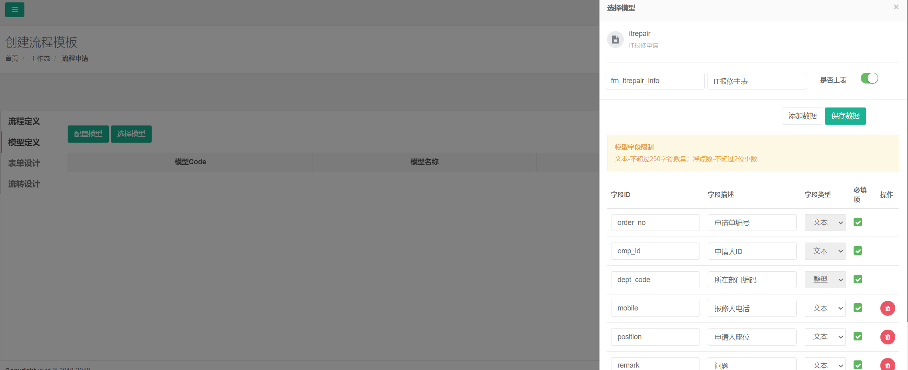</a>

<a href="imgs/demo_simple_flow_design3.png" target="_blank" title="查看大图"></a>

**表单设计**

点配置表单，填写表单标识：`itApply`（表单名）、描述；选择表单上需要显示的按钮（申请有：保存、提交；审批有：同意、拒绝、前加签、转派、协办等），

点保存并设计表单，会创建这个表单并跳转到表单设计器，加入控件并绑定模型字段到控件，保存后能在流程中使用

<a href="imgs/demo_simple_flow_design4.png" target="_blank" title="查看大图"></a>

<a href="imgs/demo_simple_flow_design5.png" target="_blank" title="查看大图"></a>

布局，控件绑定字段（必填项必须有对应控件，字段不能重复绑定）；高级控件设置数据源，见<a href="#control_api">控件API</a>

```
控件配置：

申请单号：IT报修主表/申请单编号 （数据接口 http://101.43.138.169:8880/api/common/billcode_gen/itrepair）
申请人：IT报修主表/申请人ID （数据接口 http://101.43.138.169:8880/api/user）
所在部门：IT报修主表/所在部门编码 （数据接口 http://101.43.138.169:8880/api/user_dept_select）
手机：IT报修主表/报修人电话
工位位置：IT报修主表/报修人座位
问题描述：IT报修主表/问题
```

<a href="imgs/demo_simple_flow_design6.png" target="_blank" title="查看大图"></a>

<a href="imgs/demo_simple_flow_design7.png" target="_blank" title="查看大图"></a>

点击保存，（以上是创建申请单，照此步骤原样再创建一个`itApprove`的表单，选择同意、拒绝按钮供审批使用）点下一步进入流程设计

**流程设计**

点编辑流程图跳转到流程设计器页面，开始画流程图：

1、必须有开始、结束节点；
2、开始节点一般会连接一个自动提交的任务节点；
3、绑定任务节点上的表单（上一步创建的）；
4、编写候选人脚本，返回候选人（之后的脚本都类似，可以封装公共脚本或者拷贝现有的）；
5、可以构造测试数据，点BUG按钮测试返回的字符串（脚本目的是返回审批人ID），确认无误后保存脚本；

设计完成后点击保存流程图。

<a href="imgs/demo_simple_flow_design8.png" target="_blank" title="查看大图"></a>

<a href="imgs/demo_simple_flow_design9.png" target="_blank" title="查看大图">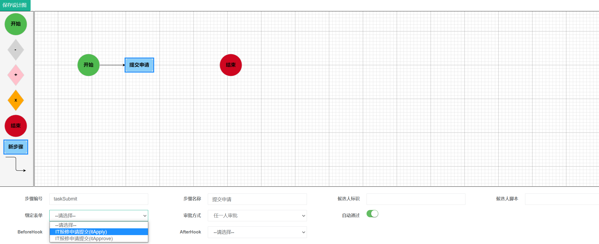</a>

<a href="imgs/demo_simple_flow_design10.png" target="_blank" title="查看大图">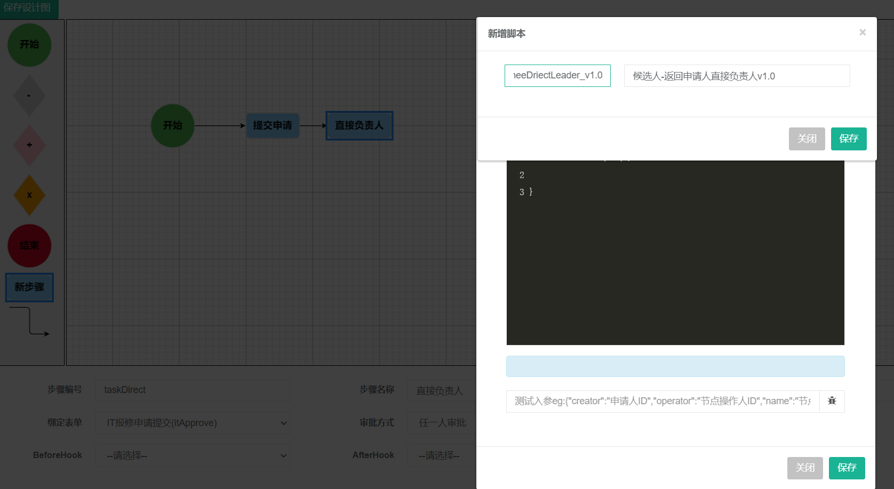</a>

<a href="imgs/demo_simple_flow_design11.png" target="_blank" title="查看大图">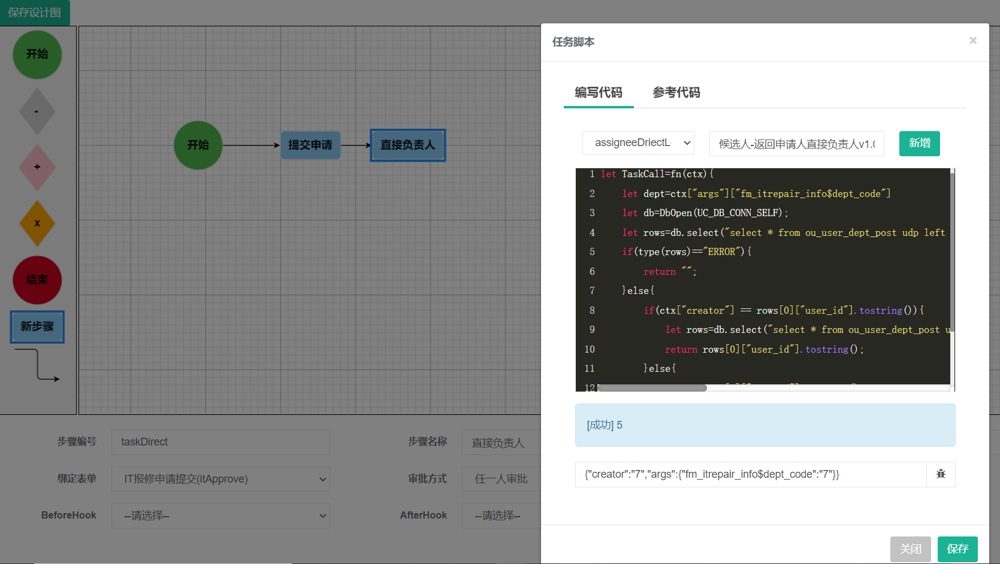</a>

```
assigneeDriectLeader_v1.0脚本内容：
let TaskCall=fn(ctx){
    let dept=ctx["args"]["fm_itrepair_info$dept_code"]
    let db=DbOpen(UC_DB_CONN_SELF);
    let rows=db.select("select * from ou_user_dept_post udp left join ou_post_info pi on udp.post_code=pi.code where pi.flag='leader' and dept_id=?",dept);
    if(type(rows)=="ERROR"){
        return "";
    }else{
    	if(ctx["creator"] == rows[0]["user_id"].tostring()){
        	let rows=db.select("select * from ou_user_dept_post udp left join ou_post_info pi on udp.post_code=pi.code where pi.flag='leader' and dept_id=(select parent_id from ou_dept_info where id=?)",dept);
            return rows[0]["user_id"].tostring();
        }else{
        	return rows[0]["user_id"].tostring();
        }
    }
}

测试数据
{"creator":"7","args":{"fm_itrepair_info$dept_code":"7"}}
```

注：任务候选人脚本约定说明参考<a href="#ass_define">候选人脚本约定</a>

<a href="imgs/demo_simple_flow_design12.png" target="_blank" title="查看大图">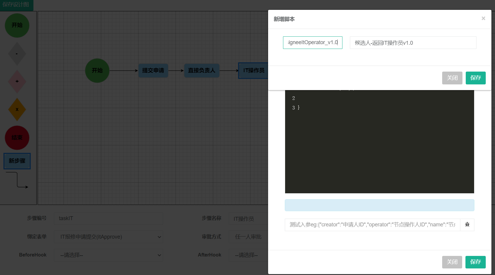</a>

<a href="imgs/demo_simple_flow_design13.png" target="_blank" title="查看大图">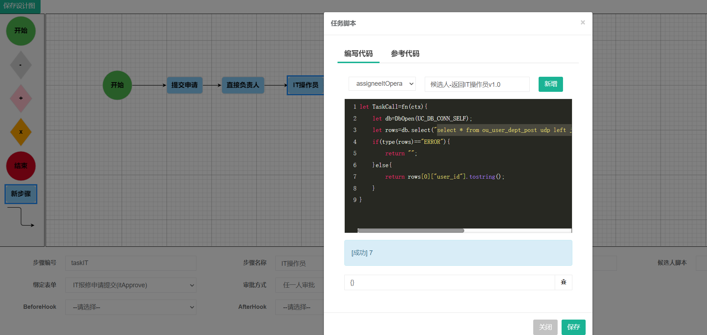</a>

<a href="imgs/demo_simple_flow_design14.png" target="_blank" title="查看大图">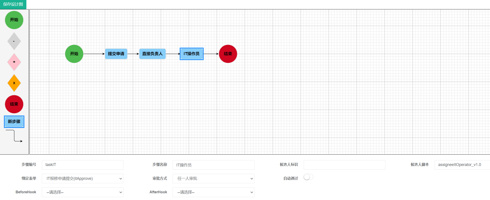</a>
```
assigneeItOperator_v1.0脚本内容：
let TaskCall=fn(ctx){
    let db=DbOpen(UC_DB_CONN_SELF);
    let rows=db.select("select * from ou_user_dept_post udp left join ou_post_info pi on udp.post_code=pi.code where pi.flag='it'");
    if(type(rows)=="ERROR"){
        return "";
    }else{
        return rows[0]["user_id"].tostring();
    }
}

测试数据
{}
```

注：任务候选人脚本约定说明参考<a href="#ass_define">候选人脚本约定</a>

**发布流程**

表单、流程审计完成后点击发布流程，流程将以新版本发布，`itrepair`就能在流程申请中可用了。

<a href="imgs/demo_simple_flow_design15.png" target="_blank" title="查看大图"></a>

<a href="imgs/demo_simple_flow_design16.png" target="_blank" title="查看大图"></a>

**数据准备**

该流程中需要选择申请的物品，在字典管理中新增几个物品，有父子分类，添加一组父子编码的数据；

编码/父编码作为项的关联关系；内容作为显示文本；分类作为这组数据的汇总标记，在之后控件内使用到；描述仅作为备注。


